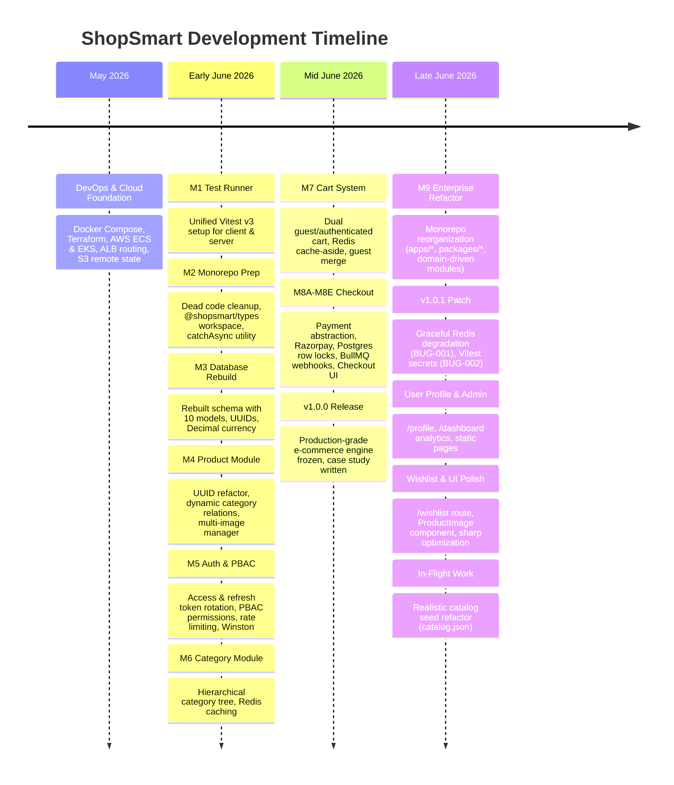

# 🛍️ ShopSmart — Comprehensive Project Status & State Reconstruction Report

> **Generated:** August 26, 2026  
> **Repository:** `shopsmart` (Full-Stack E-Commerce Monorepo)  
> **Source Analysis:** All documentation and code across `/docs`, `/docs/archive`, `/apps/server`, `/apps/client`, `/packages/*`, and Git history.

---

## Executive Summary

**ShopSmart** has graduated from an initial DevOps/CRUD MVP scaffold into a **production-grade e-commerce engine** with transactional concurrency controls, multi-provider payment abstractions, asynchronous BullMQ webhook ingestion, dual-state cart management, hierarchical categories, and an enterprise domain-driven monorepo architecture.

All core Milestones (**M1 through M8E**) and the **M9 Enterprise Monorepo Refactor** are **100% complete**. Automated test suites across the monorepo pass with **114/114 tests** (`113 passed`, `1 skipped` safely due to local Redis absence).

Development halted during catalog seed data curation and environment parameter tuning following commit `7f0527b`.

---

# 1. 📍 Where I Left Off

### 1.1 Most Recent Committed Work
* **Latest Commit:** [`7f0527b`](file:///Users/mayanksharma/Downloads/New_Projects/shopsmart) (*June 22, 2026*)  
  *Message:* `feat: introduce ProductImage component, move wishlist to top-level route, and update image configuration and seed data`
* **Features Landed in Last Commit:**
  1. Built the reusable `<ProductImage />` component with blur-up placeholder loading, dynamic sizing, and fallback error handling.
  2. Promoted Wishlist from an experimental nested component to a dedicated top-level route at `/wishlist` with persisted Zustand state and backend synchronization.
  3. Configured `next.config.mjs` image remote patterns and installed `sharp` (`^0.35.2`) for server-side image optimization.
  4. Resolved stock label UI rendering and `canManage` prop handling in `ProductCard` test suites (`b16e8e3`, `f331b34`).

### 1.2 Active In-Flight (Uncommitted) Changes
The working tree has **3 uncommitted files** representing work in progress:
1. **[`apps/server/prisma/seed/seed.ts`](file:///Users/mayanksharma/Downloads/New_Projects/shopsmart/apps/server/prisma/seed/seed.ts)**:
   * *Status:* Refactored to load realistic vendor items dynamically via `const catalogData = JSON.parse(fs.readFileSync(catalogPath, 'utf-8'));`.
   * *Blocker:* The target file [`catalog.json`](file:///Users/mayanksharma/Downloads/New_Projects/shopsmart/apps/server/prisma/seed/catalog.json) was not yet created, which causes `pnpm db:seed` to fail with `ENOENT`.
2. **[`apps/server/src/shared/config/env.ts`](file:///Users/mayanksharma/Downloads/New_Projects/shopsmart/apps/server/src/shared/config/env.ts)**:
   * Made `FRONTEND_SERVER_URL`, `BACKEND_SERVER_URL`, `DATABASE_URL`, `TEST_DATABASE_URL`, and `REDIS_SERVER_URL` strictly required in the Zod validation schema.
   * Changed the default `JWT_ACCESS_EXPIRES_IN` from `15m` to `1d`.
3. **[`package.json`](file:///Users/mayanksharma/Downloads/New_Projects/shopsmart/package.json) & [`pnpm-lock.yaml`](file:///Users/mayanksharma/Downloads/New_Projects/shopsmart/pnpm-lock.yaml)**:
   * Installed `sharp: ^0.35.2`.

### 1.3 Active Open Document
* Open File: [`docs/archive/MILESTONE_REPORT_M8D.md`](file:///Users/mayanksharma/Downloads/New_Projects/shopsmart/docs/archive/MILESTONE_REPORT_M8D.md) (Payment Webhooks & BullMQ verification report).

---

# 2. ✅ Completed Work

```
┌─────────────────────────────────────────────────────────────────────────────┐
│                          SHOPSMART COMPLETED STACK                          │
├─────────────────────────────────────────────────────────────────────────────┤
│  Frontend:      Next.js 16 (App Router) + React 19 + Zustand + React Query  │
│  Backend:       Express 5 + TypeScript + Domain-Driven Architecture (DDD)   │
│  Database:      PostgreSQL 15 (Neon) + Prisma ORM (UUIDs + Decimal)         │
│  Caching/Queue: Redis (ioredis) + BullMQ Webhook Queue                      │
│  Security:      JWT (Rotation) + PBAC Permissions + Helmet + Rate Limit     │
│  Payments:      PaymentGateway Abstraction + Razorpay (HMAC SHA-256)        │
│  Infrastructure: Docker (Multi-stage) + AWS ECS / EKS + Terraform + CI/CD   │
└─────────────────────────────────────────────────────────────────────────────┘
```

### 2.1 Infrastructure, DevOps & Architecture (M1, M2, M9)
- [x] **Monorepo Architecture**: Structured with `pnpm` workspaces across `apps/client`, `apps/server`, and modular packages (`packages/api-contracts`, `packages/config`, `packages/logger`, `packages/observability`, `packages/shared-utils`).
- [x] **DevOps & Cloud (AWS)**:
  - Multi-stage non-root Dockerfiles for client and server.
  - Terraform Infrastructure as Code (IaC) with remote S3 backend state locking.
  - AWS ECS Fargate & EKS Kubernetes deployments.
  - Application Load Balancer (ALB) with path-based routing (`/api/*` → Backend, `/*` → Frontend).
  - GitHub Actions CI/CD pipeline (lint, typecheck, Vitest, build, Terraform plan/apply).
- [x] **Test Isolation**: Development database (`DATABASE_URL`) and testing database (`TEST_DATABASE_URL`) are isolated at the database host level on Neon, guarded by runtime Zod invariants.

### 2.2 Database & Data Modeling (M3, M8A)
- [x] **13 Production Models** with UUID string PKs and `Decimal(10,2)` monetary fields:
  - `User`, `RefreshToken`, `PasswordResetToken`
  - `Category` (Self-referencing tree for subcategory hierarchy)
  - `Product` (`basePrice`, `comparePrice`, `stock`, `images[]`, `isVisible`, `slug`, `sku`, `vendorId`)
  - `Cart`, `CartItem` (`@@unique([cartId, productId])`)
  - `Wishlist` (`@@unique([userId, productId])`)
  - `Address` (Multi-address support with `isDefault` atomic updates)
  - `Order`, `OrderItem` (Historical point-in-time price and product snapshots; JSONB address snapshots)
  - `Coupon` (FLAT and PERCENTAGE discounts with max caps and validity windows)
  - `Payment` (Multi-gateway tracking with latency and observability metrics)
  - `ProcessedWebhook` (Unique constraint on `id` for idempotent webhook deduplication)
  - `OrderAuditLog` (Immutable state transition audit trail with actor tagging)

### 2.3 Authentication & Authorization (M5)
- [x] **Token Rotation**: 15-minute JWT access tokens + 7-day SHA-256 DB-stored refresh tokens with automatic rotation and JTI collision protection.
- [x] **PBAC (Policy-Based Access Control)**: Granular permissions (`cart:read`, `cart:write`, `checkout:write`, `products:create`, `users:manage`, `analytics:read`, `categories:manage`, etc.) mapped to roles (`SUPER_ADMIN`, `ADMIN`, `VENDOR`, `CUSTOMER`).
- [x] **Security Middleware**: Helmet HTTP security headers, CORS protection, named rate-limiters (`authLimiter`, `globalLimiter`), and centralized `AppError` handling.
- [x] **Client Auth Store**: Persisted Zustand `authStore`, `AuthContext`, silent token rotation via Axios response interceptors, and `<ProtectedRoute />` route guards.

### 2.4 Product & Category Management (M4, M6, M6.1)
- [x] **Product Catalog**: Advanced search (case-insensitive name & description queries), category filtering, price sorting, visibility toggles, pagination, and slug collision handling.
- [x] **Hierarchical Categories**: Parent/child category tree with 1-hour Redis cache (`categories:tree`) and automatic write-through cache invalidation.
- [x] **Frontend Experience**: Responsive product grids, product detail pages (`/products/[id]`), `<ProductImage />` with blur placeholders, dynamic category filters, and admin forms (`ProductForm`).

### 2.5 Cart System (M7)
- [x] **Dual State Architecture**:
  - **Guests**: Client-side Zustand store serialized to browser `localStorage`.
  - **Authenticated**: PostgreSQL persistence with Redis Cache-Aside (`cart:${userId}`, 1-hour TTL, fail-open resiliency).
- [x] **Transactional Cart Merge**: On user login, guest items merge into the database cart with `.min(1)` empty merge protection, item quantity capping (max 10 per SKU), and max cart size limits (50 unique items).

### 2.6 Transactional Checkout & Order Pipeline (M8A–M8E)
- [x] **Pricing Engine**: Server-calculated subtotals, coupons (percentage/flat with discount caps), 10% tax calculation, and flat shipping rates.
- [x] **Idempotency**: `Idempotency-Key` header caching with graceful Redis degradation on disconnect ([BUG-001](file:///Users/mayanksharma/Downloads/New_Projects/shopsmart/BUG.md)).
- [x] **Pessimistic Row-Level Locking**: Atomic PostgreSQL `SELECT ... FOR UPDATE` locks on product rows (pre-sorted by UUID to prevent deadlocks), completely eliminating overselling race conditions.
- [x] **Order State Machine**: Enforces strict transitions (`PENDING` -> `PAYMENT_PENDING` -> `CONFIRMED` -> `PROCESSING` -> `SHIPPED` -> `DELIVERED` / `CANCELLED` / `REFUNDED`) via `OrderStateMachine.transition()`.
- [x] **Historical Fidelity**: JSONB address snapshots on `Order` and point-in-time `priceAtPurchase` / `productName` snapshots on `OrderItem`.

### 2.7 Payments & Webhooks (M8B, M8D, M8E)
- [x] **Payment Abstraction**: `PaymentGateway` interface decoupling business logic from external SDKs.
- [x] **Razorpay Gateway**: Full integration with raw HMAC-SHA256 signature verification and paise subunit conversions.
- [x] **Asynchronous Webhooks**: Decoupled BullMQ queue (`paymentWebhook.queue.ts`) and worker (`paymentWebhook.worker.ts`) handling `payment.captured` and `payment.failed` with 5 retries and exponential backoff.
- [x] **Frontend Checkout UI**: `/checkout` page with address selector, optimistic coupon input, dynamic Razorpay SDK loader (`loadRazorpay`), and `/checkout/success` & `/checkout/failure` routes.

### 2.8 User Profile, Admin Dashboard & Static Pages
- [x] **User Profile Portal**: `/profile`, `/profile/addresses` (multi-address management with atomic default toggling), `/profile/orders` & `/profile/orders/[id]` (order history), and `/profile/security`.
- [x] **Admin Portal**: `/dashboard` with revenue aggregations, order status distribution, user management table (`/dashboard/users`), and category management (`/dashboard/categories`).
- [x] **Wishlist Module**: Backend endpoints (`/api/wishlist`), Zustand `wishlistStore`, and `/wishlist` page.
- [x] **Informational Pages**: `/about`, `/contact`, `/terms`, `/privacy`, `/cookies-policy`.

---

# 3. 🟡 Work In Progress

| Feature / Task | What Has Been Implemented | What Remains |
| :--- | :--- | :--- |
| **Realistic Product Seed Data** | [`seed.ts`](file:///Users/mayanksharma/Downloads/New_Projects/shopsmart/apps/server/prisma/seed/seed.ts) refactored to read from `catalog.json` and upsert realistic vendor products. | [`catalog.json`](file:///Users/mayanksharma/Downloads/New_Projects/shopsmart/apps/server/prisma/seed/catalog.json) is missing on disk. Need to create the catalog JSON file or restore the embedded product array. |
| **Stripe Payment Gateway** | [`stripe.gateway.ts`](file:///Users/mayanksharma/Downloads/New_Projects/shopsmart/apps/server/src/modules/payment/stripe.gateway.ts) implements `PaymentGateway` interface as a structural stub. | Actual Stripe SDK calls (`stripe.paymentIntents.create`, webhooks, Stripe Elements) are stubbed and throw `501 NotImplemented`. |
| **Reconciliation Background Cron** | Architectural blueprint documented in M8D and `CHECKOUT_ARCHITECTURE.md`. | Scheduled BullMQ cron job to auto-cancel abandoned `PENDING` orders (>15 mins) and release locked inventory. |
| **Transactional Email Delivery** | `PasswordResetToken` and `Order` models exist in database. | BullMQ email queue and Resend / Nodemailer integration for order receipts and password reset emails. |

---

# 4. 🔴 Remaining / Not Started

### Future Roadmap & Technical Enhancements
1. **Transactional Email Service**: Resend / SendGrid / Nodemailer worker integration for order confirmation emails and password reset links.
2. **Third-Party OAuth (SSO)**: Google and GitHub authentication via Passport / NextAuth / OAuth2.
3. **MFA / 2FA (TOTP)**: Speakeasy + QR code authentication for admin and user accounts.
4. **Product Reviews & Ratings**: User review submissions with verified-buyer badges and star aggregations.
5. **Product Variants**: Size, color, and SKU variant matrix (`ProductVariant` model and frontend selector).
6. **Customer Returns & Refund Portal**: Customer return request submission and automated gateway refund triggers.
7. **Inventory Movement Log**: `InventoryMovement` model tracking inbound restocks and outbound sales adjustments.
8. **Enterprise Infrastructure Scaling**:
   - AWS CloudFront CDN distribution for edge asset caching.
   - AWS WAF (Web Application Firewall) rule group.
   - AWS Secrets Manager integration replacing `.env` secrets.
   - PgBouncer database connection pooling.
   - Sentry error monitoring (`@sentry/nextjs` and `@sentry/node`).
   - k6 load-testing test scripts under `scripts/load-tests/`.

---

# 5. ⚠️ Resolved Contradictions & Verification Notes

| Item | Obsolete Document | Authoritative State | Resolution & Explanation |
| :--- | :--- | :--- | :--- |
| **Project Roadmap Status** | [`docs/release-notes/ROADMAP.md`](file:///Users/mayanksharma/Downloads/New_Projects/shopsmart/docs/release-notes/ROADMAP.md) lists Accounts, Payments, Search, and Cart as *"Coming Soon"*. | Active Codebase & [`RELEASE_NOTES.md`](file:///Users/mayanksharma/Downloads/New_Projects/shopsmart/docs/release-notes/RELEASE_NOTES.md) | **Resolved:** `ROADMAP.md` was an early May 2026 beginner DevOps roadmap. All those features were fully completed in Milestones M4–M8 (June 2026). |
| **API Contract & Formats** | [`docs/API.md`](file:///Users/mayanksharma/Downloads/New_Projects/shopsmart/docs/API.md) shows integer IDs (`id: 1`), float prices, and free-text categories. | [`docs/api/openapi.yaml`](file:///Users/mayanksharma/Downloads/New_Projects/shopsmart/docs/api/openapi.yaml) & [`apps/server/src/modules/`](file:///Users/mayanksharma/Downloads/New_Projects/shopsmart/apps/server/src/modules) | **Resolved:** `docs/API.md` is a deprecated April 2026 prototype document. The actual API uses UUIDs, Decimals, Category relations, and PBAC auth. |
| **Database Architecture** | [`docs/architecture/DATABASE.md`](file:///Users/mayanksharma/Downloads/New_Projects/shopsmart/docs/architecture/DATABASE.md) describes only 1 model (`Product`). | [`schema.prisma`](file:///Users/mayanksharma/Downloads/New_Projects/shopsmart/apps/server/prisma/schema.prisma) & [`DATABASE_RELATIONSHIP_DIAGRAM.md`](file:///Users/mayanksharma/Downloads/New_Projects/shopsmart/docs/architecture/DATABASE_RELATIONSHIP_DIAGRAM.md) | **Resolved:** `DATABASE.md` was never updated after M3. The true schema contains 13 models. |
| **Auth Token Storage Strategy** | [`docs/adr/0002-authentication.md`](file:///Users/mayanksharma/Downloads/New_Projects/shopsmart/docs/adr/0002-authentication.md) proposed HttpOnly cookies. | [`apps/server/src/shared/middleware/auth.middleware.ts`](file:///Users/mayanksharma/Downloads/New_Projects/shopsmart/apps/server/src/shared/middleware/auth.middleware.ts) & [`apiClient.ts`](file:///Users/mayanksharma/Downloads/New_Projects/shopsmart/apps/client/src/lib/apiClient.ts) | **Resolved:** The implementation uses **Bearer JWT access tokens in the `Authorization` header** + DB refresh tokens rotated via Axios interceptors. |
| **Inventory Locking Strategy** | Early M7/M8 design notes described Redis `DECRBY` inventory reservation. | [`MILESTONE_REPORT_M8C.md`](file:///Users/mayanksharma/Downloads/New_Projects/shopsmart/docs/archive/MILESTONE_REPORT_M8C.md) & [`PORTFOLIO_CASE_STUDY.md`](file:///Users/mayanksharma/Downloads/New_Projects/shopsmart/docs/release-notes/PORTFOLIO_CASE_STUDY.md) | **Resolved:** Redis inventory reservation was deprecated due to cache/DB drift risks during server crashes. The production engine uses PostgreSQL `SELECT ... FOR UPDATE` row locks. |
| **Broken Seed Script** | Uncommitted working tree | [`apps/server/prisma/seed/seed.ts`](file:///Users/mayanksharma/Downloads/New_Projects/shopsmart/apps/server/prisma/seed/seed.ts) | **Needs Action:** `seed.ts` attempts to read `catalog.json`, which does not exist. |

---

# 6. 📅 Reconstructed Development Timeline



---

# 7. 🎯 Recommended Next Steps

### Priority 1: Fix the Uncommitted Seed Script (Immediate Blocker)
* Create [`apps/server/prisma/seed/catalog.json`](file:///Users/mayanksharma/Downloads/New_Projects/shopsmart/apps/server/prisma/seed/catalog.json) containing realistic product records across all 6 core categories (`electronics`, `clothing`, `home-garden`, `sports`, `toys`, `books`), or revert `seed.ts` to the embedded product array.
* Run `pnpm db:seed` to verify database hydration.

### Priority 2: Implement the Order Reconciliation Cron Job
* Add a scheduled BullMQ worker in `apps/server/src/workers/reconciliation.worker.ts` running every 5 minutes.
* Query `Order` records stuck in `PENDING` for >15 minutes, query Razorpay to verify payment status, and automatically transition unpaid orders to `CANCELLED` while returning stock to inventory.

### Priority 3: Integrate Transactional Emails (Resend / Nodemailer)
* Create `apps/server/src/modules/email/` and connect it to a BullMQ email queue.
* Dispatch order confirmation emails upon `payment.captured` webhook events.
* Wire up password reset email delivery using the existing `PasswordResetToken` table.

### Priority 4: Complete Stripe Payment Gateway
* Implement the methods in [`apps/server/src/modules/payment/stripe.gateway.ts`](file:///Users/mayanksharma/Downloads/New_Projects/shopsmart/apps/server/src/modules/payment/stripe.gateway.ts) (`createOrderSession`, `verifyPayment`, `processRefund`) using the `stripe` SDK to provide multi-gateway redundancy.

### Priority 5: Implement Product Reviews & Variants
* Add the `Review` model and `ProductVariant` model to `schema.prisma`.
* Expose review submission endpoints with verified buyer validation.

---

# 8. 🚀 You Can Continue From Here

To resume development immediately:

1. **Fix the seed script:** Add [`catalog.json`](file:///Users/mayanksharma/Downloads/New_Projects/shopsmart/apps/server/prisma/seed/catalog.json) with realistic product records.
2. **Review your uncommitted `env.ts`:** Confirm whether `JWT_ACCESS_EXPIRES_IN` should remain `1d` for local DX or `15m` for strict production.
3. **Commit your in-flight work:** `git add apps/server/prisma/seed apps/server/src/shared/config package.json pnpm-lock.yaml && git commit -m "chore: update catalog seed data and environment validation"`.
4. **Start the next feature:** Proceed with the **Reconciliation Cron Job** or **Transactional Email Queue**.
