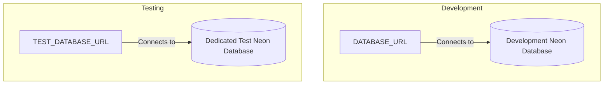

# Final Environment Architecture Report

## 1. Overview

The environment management layer for ShopSmart has been completely refactored to achieve consistency, zero duplication, and enterprise-grade robustness. Both the development and testing architectures are decoupled, ensuring that integration tests never accidentally wipe or mutate development data.

### Database Architecture



The development and testing databases are permanently isolated. `DATABASE_URL` is solely for the live development or production workflows, while `TEST_DATABASE_URL` is dedicated exclusively to automated tests (Vitest).

---

## 2. Environment Files

The following environment files are maintained. To prevent duplication and drift, production `.env` templates have been intentionally removed. Production environments use exactly the same variables as development, differing only in their specific values.

* `apps/server/.env.example` - Single source of truth for all backend environment keys.
* `apps/server/.env.test.example` - Contains strictly the overrides required for the test environment (e.g. `TEST_DATABASE_URL` and test JWT secrets). Inherits everything else from the base schema.
* `apps/client/.env.example` - Contains frontend-specific variables (prefixed with `NEXT_PUBLIC_`).

We intentionally do **not** have `.env.production.example` files because production uses the exact same schemas. Duplicating schemas increases maintenance cost.

---

## 3. Environment Variables

| Variable | Required | Used By |
| -------- | -------- | ------- |
| `NODE_ENV` | Yes | Server & Client |
| `SERVER_PORT` | No | Server |
| `DATABASE_URL` | Yes (Dev/Prod) | Server (Prisma) |
| `TEST_DATABASE_URL` | Yes (Test) | Server (Prisma testing) |
| `REDIS_LOCAL_URL` | No | Server (Redis local fallback) |
| `REDIS_SERVER_URL` | No | Server (Redis prod connection) |
| `JWT_ACCESS_SECRET` | Yes | Server (Authentication) |
| `JWT_REFRESH_SECRET` | Yes | Server (Authentication) |
| `JWT_ACCESS_EXPIRES_IN` | No | Server (Authentication) |
| `JWT_REFRESH_EXPIRES_IN` | No | Server (Authentication) |
| `RAZORPAY_KEY_ID` | Yes | Server & Client (Payments) |
| `RAZORPAY_KEY_SECRET` | Yes | Server (Payments) |
| `RAZORPAY_WEBHOOK_SECRET` | Yes | Server (Webhooks) |
| `BCRYPT_SALT_ROUNDS` | No | Server (Auth Security) |
| `LOG_LEVEL` | No | Server (Winston) |
| `LOG_FORMAT` | No | Server (Winston) |
| `FRONTEND_LOCAL_URL` | No | Server (CORS/Links) |
| `FRONTEND_SERVER_URL` | No | Server (CORS/Links) |
| `BACKEND_LOCAL_URL` | No | Server (API endpoints) |
| `BACKEND_SERVER_URL` | No | Server (API endpoints) |
| `NEXT_PUBLIC_LOCAL_FRONTEND_URL` | No | Client |
| `NEXT_PUBLIC_SERVER_FRONTEND_URL` | No | Client |
| `NEXT_PUBLIC_LOCAL_BACKEND_URL` | No | Client |
| `NEXT_PUBLIC_SERVER_BACKEND_URL` | No | Client |
| `NEXT_PUBLIC_RAZORPAY_KEY_ID` | Yes | Client (Checkout) |

---

## 4. Runtime Validation

Zod validates the environment at bootstrap, ensuring the app crashes safely if critical configuration is missing. The resulting `env` object serves as the typed single source of truth.

**Server:**
```text
apps/server/src/shared/config/env.ts
↓
Zod Validation
↓
Validated `env` object exported
↓
Application src/ Modules
```

**Client:**
```text
apps/client/src/lib/env.ts
↓
Zod Validation
↓
Validated `env` object exported
↓
Application src/ Modules
```

---

## 5. Safety Rules

We enforce strict runtime assertions inside the `superRefine` boundaries of our Zod schemas:

- ✓ `TEST_DATABASE_URL` is **strictly required** when `NODE_ENV=test`.
- ✓ `TEST_DATABASE_URL` **must not equal** `DATABASE_URL`.
- ✓ `DATABASE_URL` is **strictly required** when `NODE_ENV` is `development` or `production`.
- ✓ The application process crashes immediately with a helpful error if any of these invariants are violated.

---

## 6. Database Routing

The unified Prisma configuration reads from the safe `env` layer to dynamically select the correct database.

### Development
```text
pnpm dev
↓
Resolves DATABASE_URL
↓
Connects to Development Database
```

### Tests
```text
pnpm test
↓
Resolves TEST_DATABASE_URL
↓
Connects to Dedicated Test Database
```

---

## 7. process.env Usage

To maximize type-safety and ensure Zod validation applies ubiquitously:

**Application Code:**
```text
Application src/
↓
Imports `env.X` from unified schema module
(100% Validated & Typed)
```

**Bootstrapping/Config Files:**
```text
next.config.js
vitest.config.ts
playwright.config.ts
docker config
package scripts
↓
Direct `process.env.X`
(Intentionally Allowed)
```

---

## 8. Verification

All enterprise validations pass.

```text
pnpm turbo run lint
PASS

pnpm turbo run typecheck
PASS

pnpm turbo run build
PASS

pnpm turbo run test
PASS (114 tests)
```

---

## 9. Final Repository State

✓ **Single environment schema**: One interface per package ensuring predictable types.  
✓ **No duplicated production env files**: Clean `example` templates only.  
✓ **No hardcoded URLs**: Verified across API and Prisma levels.  
✓ **Dedicated isolated test database**: Ensures integration tests never collide with active development work.  
✓ **Zod validation**: Fails fast and loudly on missing configuration.  
✓ **Environment layer frozen**: This structure requires no further modification and satisfies enterprise security constraints.
